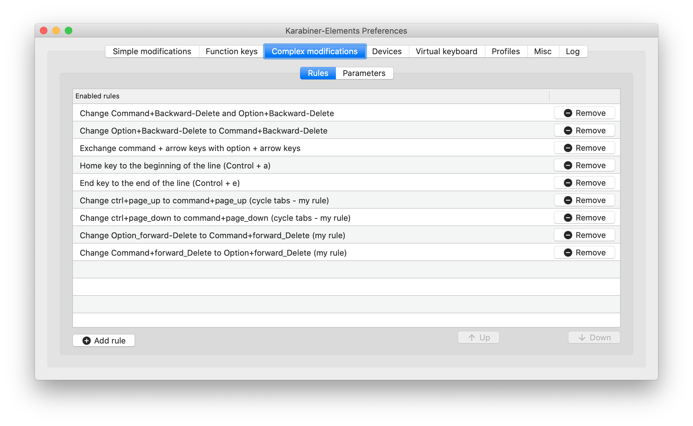

# custom-karabiner-elements-configuration
https://github.com/tekezo/Karabiner-Elements 

## configuration documentation and examples
https://github.com/pqrs-org/KE-complex_modifications/blob/master/docs/json/finder.json
https://pqrs.org/osx/karabiner/json.html#root-data-structure

## My configuration
With this configuration file deletion works with finder using:
option+backward_delete

* The last 4 rules are my own rules
* The rest is imported via from the Internet via the karabiner interface

#### fixes tab swithing (Chrome and iTerm2):
* Change ctrl+page_up to command+page_up (cycle tabs - my rule)
* Change ctrl+page_down to command+page_down (cycle tabs - my rule)

#### fixes deleting one word with forward-delete:
* Change Command+forward_Delete to Option+forward_Delete (my rule)
* Change Option_forward-Delete to Command+forward_Delete (my rule)
 

